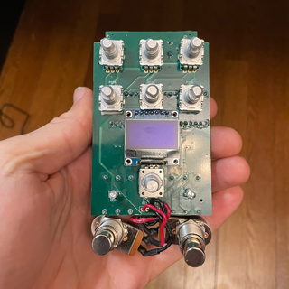
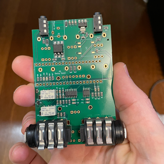

# Guitar Pedal 125b

### Rev 5 - 6/30/2023

Updates include:
1. Updated placement of screen slightly to ease installation.
2. Updated POT footprint mounting holes to be slightly larger.
3. Properly grounded Audio TRS jacks when no cable is inserted.

### Overview

A project to create a digital effect pedal based on the Electro-Smith Daisy Seed that fits into a standard 125B sized Guitar Pedal enclosure.

This project is still work in progress and is an evolution of my [1590B sized Pedal](https://github.com/bkshepherd/DaisySeedProjects/tree/main/GuitarPedal1590b). Documenation is sparse at the moment, but I hope to improve it over time.

 
 
 

### Features

1. 125B size pedal board friendly enclosure!
2. Buffered Stereo Input and Outputs for Guitar Level signals
2. Relay based "True Bypass" switching
3. TRS Mini MIDI Input and Outputs
4. OLED Display
5. Rotary Encoder for Display Navigation
6. 6 Pots
7. Up to 2 Footswitches
8. Up to 2 Leds
9. Standard 9v center pin negative power jack
10. Easy access to the Daisy Seed USB port and reset buttons for updating the firmware
11. Primarily SMD parts for easy assembly by your PCB provider
12. Easily order a custom drilled enclosure from Tayda! [Template Here](https://drill.taydakits.com/box-designs/new?public_key=ZXRnaU9PaWx0b1hNa3VxeTJua3d2dz09Cg==)

This project includes a KiCad project with the necessary schematics and PCB layout files to create everything you need to build the hardware. I actually used JLCPCB to manufacture the PCB and assemble the SMD parts and most of the through-hole parts.  The BOM file is in the proper format for them to assemble it with their available parts. You will then need to hand solder the following additional parts:

1. 2 Headers 20-Pin Single Row for the Daisy Seed. I used these from [Amazon](https://www.amazon.com/dp/B09MYBZZKZ)
2. 6 Pots. These are the ones I used [PRS11R-415F-N103B1](https://www.newark.com/bourns/prs11r-415f-n103b1/rotary-potentiometer-10kohm-0/dp/65AH0672). Also make sure to use some non-conductive double sided tape under them to prevent any contact with the circuit board.
3. 1 Rotary Encoder. This is the one I used [PEC11R-4215K-S24](https://www.mouser.com/ProductDetail/652-PEC11R-4215K-S24)
4. 1 OLED Screen. This is the one I used from [Amazon](https://www.amazon.com/dp/B01MQPQF24)
5. 2 Leds (3mm Any Color). These are the one I used from [Amazon](https://www.amazon.com/dp/B07QXR5MZB)
7. 2 Footswitches. These are the ones I used from [Amazon](https://www.amazon.com/dp/B08TBTWDYV)

Make sure to solder them in the following order (everything goes on the side without the SMD parts, except the 20-pin headers):

1. Pots 1 - 3
2. Rotary Encoder
3. Both 20pin Headers (make sure this goes on the side with all the SMD parts!)
4. Pots 4 - 6
5. OLED Screen
6. 2 Leds
7. 2 Footswitches

Sample Code is also provided with a hardware abstraction layer as well as a custom Tremolo effect that uses the hardware.

Information about the Daisy Seed can be found at:

http://electro-smith.com

Information about KiCad can be found at:

https://www.kicad.org

## Past Revisions
### Rev 4 - 5/16/2023

Updates include:
1. Updated PCB design to improve the True Bypass relay switching to include an anti-pop hardware mute.
2. Update Example Software to take advantage of the anti-pop mute.
3. Update Example Software to provide a basic menu system for the OLED Screen
4. 
### Rev 3 - 4/14/2023

Updates include:
1. Swapped the placement of the Footswitches and LEDs on the PCB to be consistent with my other pedals.

Known Issues:
1. Relay bypass has an audible pop when enabling / disabling the effect. Sounds like a common issue with relay and 3pdt switch true bypass systems.  Investigating fixing / minimizing it with an a solution similar to this [anti-pop system](https://www.coda-effects.com/2016/08/relay-bypass-with-anti-pop-system.html). Hope to add this in Rev 4.

### Rev 2 - 3/29/2023

Updates include:
1. Added 3 Additional Pots (Total of 6)
2. Improved OLED Screen Placement
3. Removed an Encoder (now just 1)
4. Tayda Custom Drill Template for easily ordering a pre-drilled enclosure
