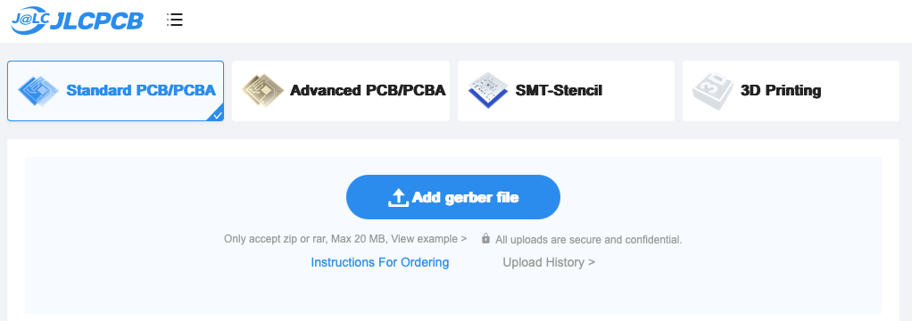
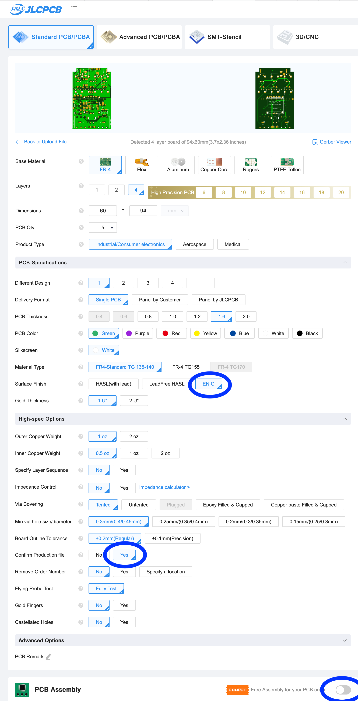
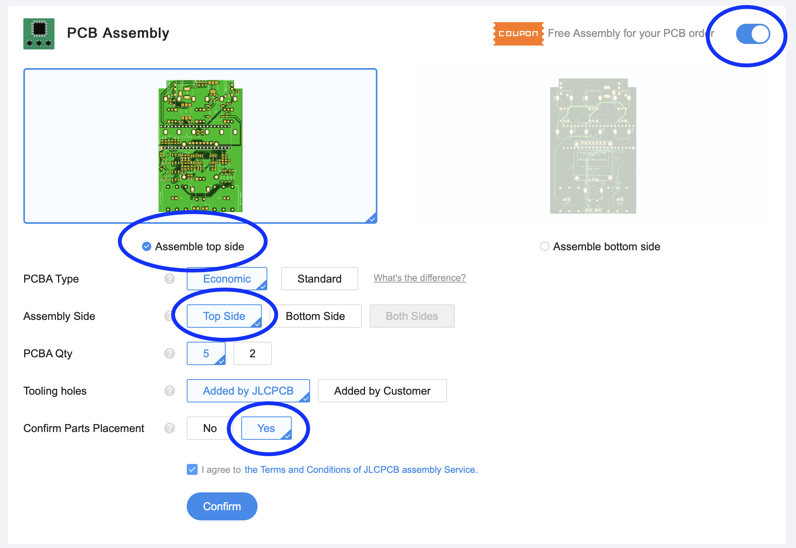
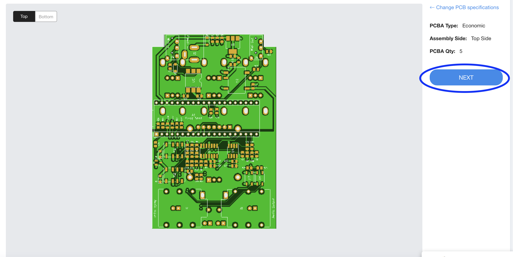
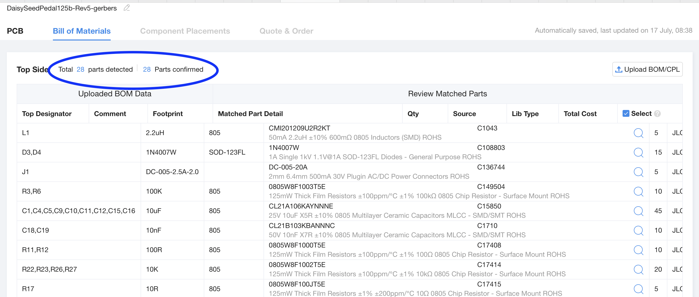
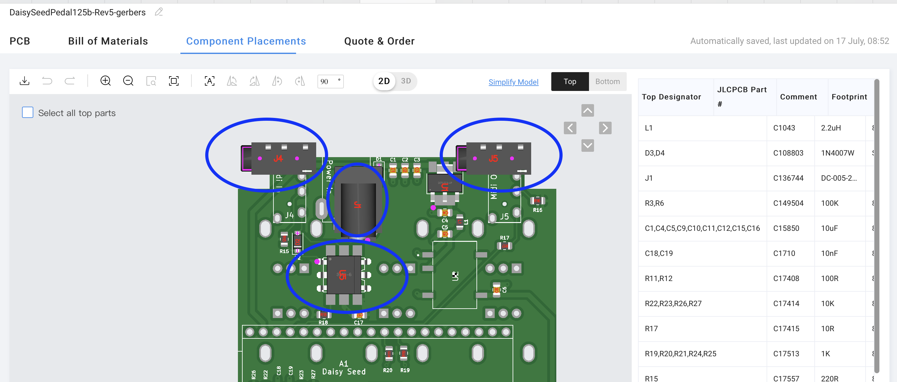
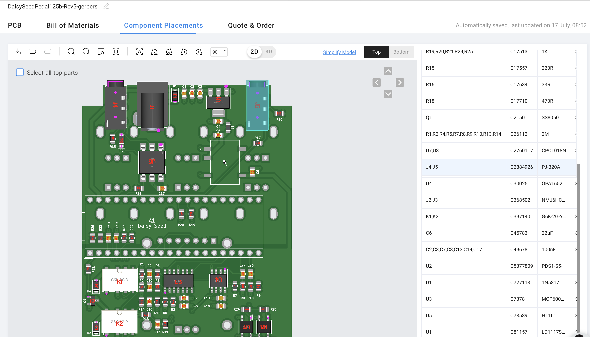

# Building the Hardware
Some quick instructions for how to make the GuitarPedal125B Hardware.  This document assumes you know the basics about soldering and circuit board assembly.  You'll also need to be fairly handy with a drill to mount the various knobs and switches on the enclosure (or you can order one pre-made from Tayda).

Quick note, I couldn't include some of the custom footprints for specific components due to licenses that wouldn't allow redistribution.  Here is a list of where you can find some of them:

* PDS1-S5-S5-M - https://www.cui.com/product/dc-dc-converters/isolated/pds1-m-series (click on "all models" for downloadable footprints)
* Neutrik NMJ6HCD2 - https://www.snapeda.com/parts/NMJ6HCD2/Neutrik/view-part/
* PJ-320A - Footprint and STEP Model found on this repository https://github.com/keebio/Keebio-Parts.pretty

Also, I just want to acknowledge that the schematics for the circuits were kit bashed together from the following sources with some additions of my own:

* [Electro-Smith: Daisy Petal Rev 5 Schematics](https://github.com/electro-smith/Hardware/blob/master/reference/daisy_petal/ES_Daisy_Petal_Rev5.pdf)
* [Simple DIY Electronic Music Projects](https://diyelectromusic.wordpress.com/2022/08/29/3v3-midi-module-pcb/)

Getting everything into KiCad and the PCB layouts are all my own work.

The KiCad files are included for the full schematic and pcb board layout in the **pcb** folder.  You really don't need to know anything about KiCad to order the PCB and get it made, but they are there for reference.

I like to order my PCBs from https://www.jlcpcb.com, but anywhere should work fine.

Follow these steps to get the PCB made by JLCPCB:

## 1. Generate the Gerber & Drill Files

The first step is to use KiCad to export the Gerber & Drill files for production like this: [JLCPCB Gerber and Drill File Generation](https://jlcpcb.com/help/article/16-How-to-generate-Gerber-and-Drill-files-in-KiCad-6). You can also skip this part and simply use the ready-made [JLCPCB Gerber Files](../pcb/JLCPCB-Gerbers/DaisySeedPedal125b-Rev5-gerbers.zip) for this project. (Keep the files zipped)

## 2. Generate BOM and Centroid Files

To use SMT Assemble service from JLCPCB, which you will want to do, the BOM and centroid files need to be generated as well. [Follow these instructions provided by JLCPCB](https://jlcpcb.com/help/article/81-How-to-generate-the-BOM-and-Centroid-file-from-KiCAD). You can also skip this part and simply use the ready-made files for this project:

1. [JLCPCB BOM](../pcb/BOM_JLCSMT_DaisySeedGuitarPedal125b.xlsx)
2. [JLCPCB Centroid](../pcb/JLCPCB-Gerbers/DaisySeedPedal125b-top-pos.csv)

## 3. Pre-Order Parts

There are a few parts that JLCPCB doesn't stock normally.  You can either pre-order these parts through JLCPCB through their Global Sourcing Service so they can be assembled for you (recommended) of you can order the parts yourself and solder them yourself (advanced).

The main parts they don't stock are:

1. PDS1-S5-S5-M (JLCPCB Part #C5377809)
2. CPC1018N (JLCPCB Part #C1558973), or as a substitute CPC1019N (JLCPCB Part #C2760117)

To order these parts through JLCPCB follow these instructions:

1. Visit the [JLCPCB Website](https://www.jlcpcb.com) and log into your account.
2. Go to the [Parts Manager Page](https://jlcpcb.com/user-center/smtPrivateLibrary/).
3. Click on Order Parts 
4. There are two options for ordering parts JLCPCB Parts and Global Parts Sourcing.  I always try to use JLCPCB Parts ordering first, but sometimes you have to use Global Parts Sourcing.
5. First try looking in JLCPCB Parts and search using the above JLCPCB Part #s.  If you can order it there, great, do so.  You'll need to order at least 5 of each part.
6. If you can't find it there (sometimes the prices are crazy high, or the min quantity is a huge number), then try Global Parts Sourcing. 
7. Search for the part by name in Global Part Sourcing.
5. Find a supplier that lets you order a small quantity and double check the part name to make sure it's the right part.
6. Order at least 5 parts. (Minimum PCB assembly order is 5, so you need 5 of each part).
7. Repeat this process for both parts. 

Please note, that it typically takes a week or two to get the parts ordered and into your parts library for use.  So I like to order these parts in batches enough to place a few orders. 
 
JLCPCB will order and assemble most of the parts for this project.  There are a few parts that you will need to order yourself and solder at the end.  Here is a list of the additional parts to order:

1. 2 Headers 20-Pin Single Row for the Daisy Seed. I used these from [Amazon](https://www.amazon.com/dp/B09MYBZZKZ)
2. 6 Pots. These are the ones I used [PRS11R-415F-N103B1](https://www.newark.com/bourns/prs11r-415f-n103b1/rotary-potentiometer-10kohm-0/dp/65AH0672). Also make sure to use some non-conductive double sided tape under them to prevent any contact with the circuit board.
3. 1 Rotary Encoder. This is the one I used [PEC11R-4215K-S24](https://www.mouser.com/ProductDetail/652-PEC11R-4215K-S24)
4. 1 OLED Screen. This is the one I used from [Amazon](https://www.amazon.com/dp/B01MQPQF24)
5. 2 Leds (3mm Any Color). These are the one I used from [Amazon](https://www.amazon.com/dp/B07QXR5MZB)
7. 2 Footswitches. These are the ones I used from [Amazon](https://www.amazon.com/dp/B08TBTWDYV)

## 4. Order the Assembled PCBs from JLCPCB

1. Have the Gerber, Drill, BOM, and Centroid files handy. (Keep the files zipped)
2. Visit the [JLCPCB Website](https://www.jlcpcb.com).
3. Click the **Order Now** button in the top menu bar.
4. Click the **Add Gerber File** button.
  
   
   
5. Upload the zipped Gerber files you downloaded above.
6. After processing the files it should provide a screen with various options. Most everything is fine by default, but you should use ENIG finishing options instead of HASL, you should check the Confirm Production File option and turn on PCB Assembly. 
7. Once you turn on PCB Assembly, you will need to confirm that you want the Top Side assembled and definitely select the Confirm Parts Placement option. 
8. Click the Confirm button on the PCB Assembly panel.
9. This page shows you the side being assembled. It should look like this.   Click Next.
10. Next you need to upload the BOM and Centroid File. 
11. Click Add BOM and upload the BOM file. Either the one you generated or the one you downloaded above [JLCPCB BOM](../pcb/BOM_JLCSMT_DaisySeedGuitarPedal125b.xlsx).
12. Click Add CPL and upload the Centroid file. Either the one you generated or the one you downloaded above [JLCPCB Centroid](../pcb/JLCPCB-Gerbers/DaisySeedPedal125b-top-pos.csv). 
13. After the files are uploaded click Process BOM and CPL. 
14. This page asks you to confirm the parts.  You should see at the top 28 Parts Detected and 28 Parts Confirmed.  If it tells you any parts are missing, you may need to substitute. For instance, the parts you ordered from global parts sourcing may have ended up with a different JLCPCB Part number than the ones in the supplied files.  If that is the case you can click on the part in the list and search for the proper part and replace it.  Repeat this process until all parts are accounted for.
15. Click Next.
16. This next page allows you to view the placement of the Components.  Notice that a few of the parts of not placed or rotated properly. (this is due to differences in KiCad's footprint library and JLCPCB's library). 
17. You will have to manually fix them in this viewer.  Simply click each part that is not properly placed, and use the buttons to rotate and move them until they are in place. The parts that need fixing are J1,J4,J5,U1,U3,U4,U5,U7,U8,K1,K2,Q1.  It should look like this when fixed. 
18. Click Next.
19. Add the item to your cart, and order the PCB. 

They will give you a price for ordering 5 pcbs (that's their minimum order).  I think I paid ~$50 for a Purple board with ENIG (this is a more expensive option).  It will take a week or two for it arrive and they look like this:

## 5. Solder Everything

As mentioned above, JLCPCB will not have assembled all the parts.  Primarily the pots, encoders, leds, foot swithces, and screen will still need to be assembled by hand.  

Make sure to solder them in the following order (everything goes on the side without the SMD parts, except the 20-pin headers):

1. Pots 1 - 3
2. Rotary Encoder
3. Both 20pin Headers (make sure this goes on the side with all the SMD parts!)
4. Pots 4 - 6
5. OLED Screen
6. 2 Leds
7. 2 Footswitches
   
It will roughly look like this when finished with this step:

## 6. Flash the Software to the Hardware

Before you attempt to get everything fitted into the enclosure, it's best to make sure all the hardware works.

You'll need to compile the code and flash it into the Daisy Seed on the hardware. Instructions can be found [here](../README.md).

## 7. Order the Enclosure

You'll also need to order the enclosure, which is 125B sized.

You can either order a generic one like this from Amazon: https://www.amazon.com/dp/B07VKR51NN and drill your own holes (which is a pain in the butt), or you can order a custom drilled & powder coated enclosure from Tayda using this [Custom Drill Template](https://drill.taydakits.com/box-designs/new?public_key=YWRhVFFGU0Z2c3RJR09VQ1U4S3EvUT09Cg==)

Please note, the top two tiny holes inbetween the knobs are so you can reach the flash and reset buttons on the DaisySeed, for easy re-programming during development.  You can keep or omit them. 

## 8. Jam everything into the enclosure, and ENJOY!

