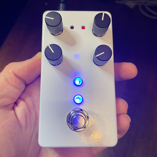

# Guitar Pedal 1590b

### Rev 3 - 3/29/2023

### Updates include:

1. Improved 4 Layer PCB Layout, much easier to assemble!
2. Replaced all SMD parts with through-hole alternative

### Overview

A project to create a digital effect pedal based on the Electro-Smith Daisy Seed that fits into a standard 1590B sized Guitar Pedal enclosure. Electro-Smith sells a guitar pedal, but it's a much larger format, and I wanted something as small as possible.  The PedalPCB Terrarium was another option, but it's mono only, so I decided to build my own.  This one is Stereo In / Out and has Midi In / Out, so it's quite flexible and can be programmed to do a lot.

 

 

This project includes a KiCad project with the necessary schematics and PCB layout files to create everything you need to build the hardware and code the provides a hardware attraction layer as well as sample code with a custom Tremolo effect that uses the hardware.

Click on this image for a Demo Video:

Information about the Daisy Seed can be found at:

http://electro-smith.com

Information about KiCad can be found at:

https://www.kicad.org

Getting Started:

1. [Build the Hardware](docs/README.md)
2. [Deploy the Software to the Hardware](src/README.md)
