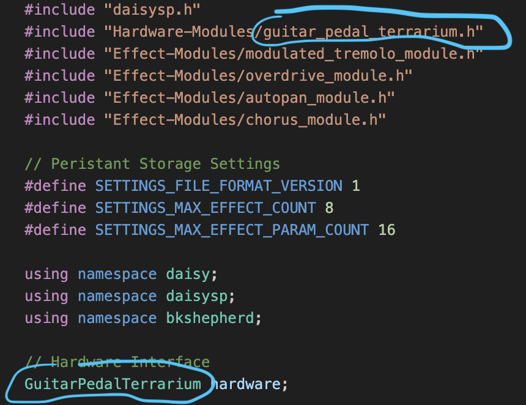

# Multi-Effect Guitar Pedal Software
This directory includes all the source code for my Multi-Effect Guitar Pedal that runs on various hardware platforms. 

## Software Update - 11/11/2023
Updates include:

1. Refactored the code to move Display UI handling and Persistent Storage out of the main class file.
2. Added functionality to make it easy for an Effect Module to provide custom UI for the Display while the Effect is Active.

## Getting Started
Before you can use the software you'll need to do the following:

### 1. Setup your Development Environment

The code in this project is supplied with a Microsoft Visual Code project and depends on both **LibDaisy** and **DaisySP** from Electro-Smith. Detailed instructions on setting these up for your dev environment can be found here:

https://electro-smith.github.io/libDaisy/index.html

### 2. Update Paths to your install of LibDaisy and DaisySP

* Note - You shouldn't have to do this step if the project pulled down from GitHub with them already included as sub-modules.  You can check in your /DaisySeedProjects/Software/GuitarPedal/libDaisy and daisySP folders. If they have files in them, you can skip this step.  If they are empty, you can try pulling down the project from GitHub again (the desktop GUI client always should pull down submodules). If it still doesn't pull down and you have libDaisy and DaisySP installed somehwere else, you can follow the steps below: 

You'll need to update the paths in the **Makefile**.
You'll also need to update the paths in the **c_cpp_properties.json** file in the **.vscode/** folder.
You'll also need to update the paths in the **task.json** file in the **.vscode/** folder.

### 3. Configure your specific Target Hardware

You'll need to open the guitar_pedal.cpp file and edit two lines to configure which hardware you are targetting.

If you want to target the GuitarPedal125B hardware change the lines to:

* #include "Hardware-Modules/guitar_pedal_125b.h"
* GuitarPedal125B hardware;

If you want to target the GuitarPedal1590B hardware change the lines to:

* #include "Hardware-Modules/guitar_pedal_1590b.h"
* GuitarPedal1590B hardware;

If you want to target the GuitarPedal1590B-SMD hardware change the lines to:

* #include "Hardware-Modules/guitar_pedal_1590b-SMD.h"
* GuitarPedal1590B-SMD hardware;

If you want to target the Pedal PCB hardware change the lines to:

* #include "Hardware-Modules/guitar_pedal_terrarium.h"
* GuitarPedalTerrarium hardware;

### 4. Build and Deploy the Code

Next you have to get the code onto your daisy seed based Guitar Pedal hardware using **task build_and_program_dfu**

### 5. Connect your Guitar and Amp

Plug your guitar into the Input and connect the Output to your amp.

### 6. Enjoy!!!

## Past Updates:

### Software Update - 10/9/2023
Updates Include:

1. Added support for multiple effects.  Included are a simple tremolo, chorus, overdrive, and stereo auto-panning effects.
2. Created a Hardware Abstraction Layer allowing this software to run on different Daisy seed based hardware targets including my custom hardware as well as the Pedal PCB Terrarium.
3. Updated the menu system to support multiple effects each with their own settings and global hardware settings. Parameters can be updated directly through the menu UI or using the pots on the device.
4. All settings / parameters are now saved to the device memory and restored when the device powers up.
5. Added Midi support to make it simply to map effect parameters to Midi CC commands for controlling presets via midi.
